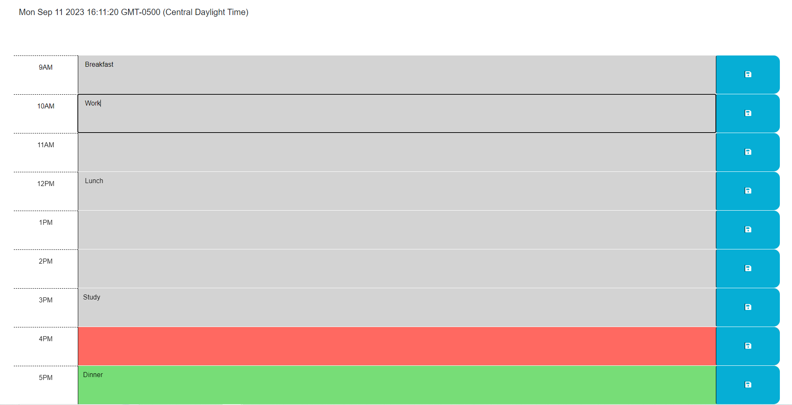

# Scheduler

## Description

- The purpose of this project was to make a schedule that saves events a user creates.
- I built this project in order to make JavaScript code that would make a scheduler app that is functionable.
- The  project solves the problem of making a scheduling app that can actually save events that a user writes into it.
- I learned how to properly use localStorage.setItem and localStorage.getItem.

## Installation

N/A

## Usage

This website is used for scheduling a work day.

https://derekm129.github.io/calendarApp/

## Credits

N/A

## License

Please refer to the license in the repo.
